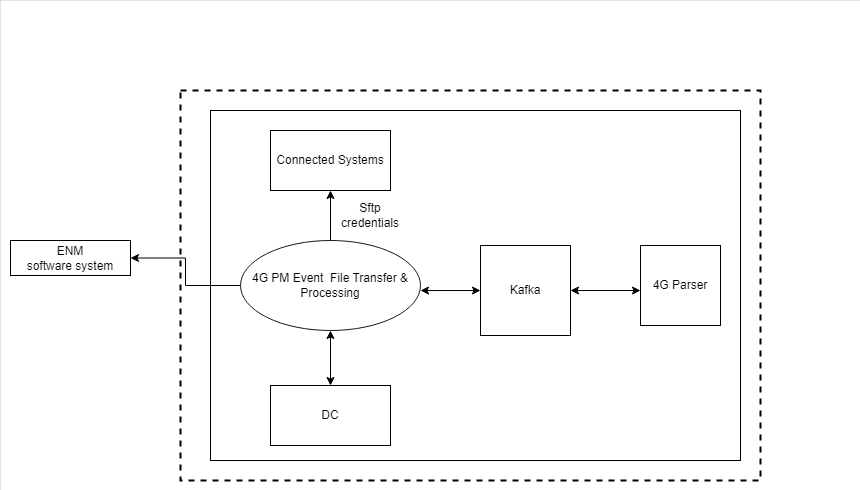

# 4G PM Event File Transfer and Processing Application Developers Guide
[TOC]

## Introduction

The primary goal of the 4G PM Event File Transfer and Processing service is to collect 4G event files from Ericsson
Network Manager based on the notifications read from Message Bus KF and produced by the File Notification Service.
4G PM Event File Transfer and Processing service parses the 4G event files it receives and splits the contents of each file by eventID into records in CTR format. The records are written
onto a Message Bus KF Output Topic to be consumed by 4g-pm-event-parser.

## Interface Description

The 4G PM Event File Transfer and Processing Service interfaces with the following components:

* Kafka
* Data Catalog
* Connected Systems
* ENM Scripting VMs

The architecture diagram below shows the relationship between the microservice and the services it interfaces with:

## Prerequisites to run 4G PM Event File Transfer and Processing Service

### DMM Kafka
Kafka is part of IDUN Data Management & Movement (DMM). DMM Kafka holds input topics (File Notifications) and output topics.

#### File Available Notification Input Topic
Kafka Input topic is owned and created by the File Notification Service. It is used to alert the microservice that there are new 4G event files available.

#### Kafka Output Topic
Kafka Output Topic is owned and created by the microservice and it is registered in Data Catalog. The microservice splits the contents of each file by eventID into records in CTR format.

Kafka Optional Parameters:

| Variable Name                                         | Description                                                                                                                                                                                                                                                                                                                                                                                                                                                                                                                                                                                                                                                                                                                                                                                                                                                                                                                                                                                                                                                           | Default                                                     |
|-------------------------------------------------------|-----------------------------------------------------------------------------------------------------------------------------------------------------------------------------------------------------------------------------------------------------------------------------------------------------------------------------------------------------------------------------------------------------------------------------------------------------------------------------------------------------------------------------------------------------------------------------------------------------------------------------------------------------------------------------------------------------------------------------------------------------------------------------------------------------------------------------------------------------------------------------------------------------------------------------------------------------------------------------------------------------------------------------------------------------------------------|-------------------------------------------------------------|
| spring.kafka.topics.input.prefix                      | The prefix of the Input Topic, prepending the Ericsson Network Manager instance.                                                                                                                                                                                                                                                                                                                                                                                                                                                                                                                                                                                                                                                                                                                                                                                                                                                                                                                                                                                      | file-notification-service--4g-event--                       |
| spring.kafka.topics.output.name                       | The name of the Output Topic, prepending the Ericsson Network Manager instance.                                                                                                                                                                                                                                                                                                                                                                                                                                                                                                                                                                                                                                                                                                                                                                                                                                                                                                                                                                                       | 4g-pm-event-file-transfer-and-processing                    |

### Connected Systems
This service provides SFTP Credentials for the ENM Scripting VMs to download the files.

Connected Systems Optional Parameters:

| Variable Name             | Description                              | Default                              |
|---------------------------|------------------------------------------|--------------------------------------|
| connected.systems.baseUrl | Sets the base URL for Connected Systems. | http://eric-eo-subsystem-management  |
| connected.systems.uri     | Sets the URI for Connected Systems.      | /subsystem-manager/v1/subsystems/    |
| connected.systems.port    | Sets the port for Connected Systems.     | 80                                   |

### ENM Scripting VMs
ENM populates all the file in ENM Scripting VMs. 4G PM Event File Transfer and Processing Service downloads the file from ENM Scripting VMs.

SFTP Resilience Optional Parameters:

| Variable Name                                      | Description                                                                                                                                                                                                                  | Default |
|----------------------------------------------------|------------------------------------------------------------------------------------------------------------------------------------------------------------------------------------------------------------------------------|---------|
| eventFileDownload.numberOfEventFileDownloadRetries | Max number of times to retry downloading event file from Ericsson Network Manager Scripting VM.                                                                                                                              | 3       |
| eventFileDownload.sftpConnectionTimeoutMs          | The amount of time to wait between retries in connecting to the Ericsson Network Manager Scripting VM.                                                                                                                       | 15000   |
| eventFileDownload.sftpSessionTimeoutMs             | The timeout value used for socket connect operations. If connecting to the server takes longer than this value, the connection is broken. The timeout is specified in seconds and a value of zero means that it is disabled. | 15000   |

### Data Catalog
Data Catalog provides function to store and retrieve data using Representational State Transfer (REST) interface. The data can be stored by data producing applications and discovered by consuming applications.

Data Management and Movement Optional Parameters:

| Variable Name                           | Description                                                                                                          | Default                             |
|-----------------------------------------|----------------------------------------------------------------------------------------------------------------------|-------------------------------------|
| dmm.dataCatalog.baseUrl                 | Sets base URL for Data Catalog, used to form URL for REST operations to Data Catalog.                                | http://eric-oss-data-catalog:       |
| dmm.dataCatalog.basePort                | Sets base port for Data Catalog, used to form URL for REST operations to Data Catalog.                               | 9590                                |
| dmm.dataCatalog.dataCategory            | Sets the data category.                                                                                              | PM_EVENTS                           |
| dmm.dataCatalog.messageBusName          | Sets the name of the Message Bus to be retrieved from Data Catalog.                                                  | mb2                                 |
| dmm.dataCatalog.messageBusNamespace     | Sets the namespace where the Message Bus to be retrieved is deployed.                                                | nameSpace                           |
| dmm.dataCatalog.dataProviderTypeId      | Sets data provider type ID.                                                                                          | V2                                  |
| dmm.dataCatalog.dataProviderTypeVersion | Sets data provider type version.                                                                                     | v5                                  |
| dmm.dataCatalog.dataSpace               | Sets the data space.                                                                                                 | 4G                                  |
| dmm.dataCatalog.dataCollectorName       | Sets the data collector name.                                                                                        | enm                                 |

### PM Server
Performance Management (PM) server provides an exporter, in the form of an RPM package, which application services can include in its build to expose status about its own volumes. PM Server will then scrape the application service's exporter metrics.

### Support for Service Mesh
4G PM Event File Transfer and Processing Service supports service mesh so that the communication between services become secured.

## Monitoring

Metrics for the microservice are implemented using Micrometer Registry Prometheus.

For lists of standard metrics used by Java and Apache Kafka, refer to the following documentation:

* [JVM Metrics][jvmm]
* [HikariCP][hcp]
* [Message Bus KF microservice][mbkf]
* [Spring Boot Metrics][sbm]

### Metrics specific to the 4G PM Event File Transfer and Processing Service

1. Metric: eric-oss-4gpmevent-filetrans-proc:event.files.processed
    * Describes the number of event files that are processed.
2. Metric: eric-oss-4gpmevent-filetrans-proc:num.failed.file.transfer
    * Describes the number of files that are failed to transfer.
3. Metric: eric-oss-4gpmevent-filetrans-procc:num.successful.file.transfer
    * Describes the number of files that are successfully transferred.
4. Metric: eric-oss-4gpmevent-filetrans-proc:processed.file.data.volume
    * Describes the data value for the processed file.
5. Metric: eric-oss-4gpmevent-filetrans-proc:processed.files.time.total
    * Describes the total time required to process the files.
6. Metric: eric-oss-4gpmevent-filetrans-proc:transferred.file.data.volume
    * Describes the data value for the files that the microservice has transferred.
7. Metric: eric-oss-4gpmevent-filetrans-proc:files.parsed
    * Describes the number of files that the microservice parsed.
8. Metric: eric-oss-4gpmevent-filetrans-proc:files.failed.to.parse
    * Describes the number of files that the microservice failed to parse.

#### Default Metrics Name in the PM Server

Following table lists for all default metrics:

| Metrics Name                                                   | Metric Name in the PM Server                                                |
|----------------------------------------------------------------|-----------------------------------------------------------------------------|                                                                                                                                
|eric-oss-4gpmevent-filetrans-proc:event.files.processed         | eric_oss_4gpmevent_filetrans_proc:event_files_processed_total               |
|eric-oss-4gpmevent-filetrans-proc:num.failed.file.transfer      | eric_oss_4gpmevent_filetrans_proc:num_failed_file_transfer_total            |
|eric-oss-4gpmevent-filetrans-procc:num.successful.file.transfer | eric_oss_4gpmevent_filetrans_proc:num_successful_file_transfer_total        |
|eric-oss-4gpmevent-filetrans-proc:processed.file.data.volume    | eric_oss_4gpmevent_filetrans_proc:processed_file_data_volume                |
|eric-oss-4gpmevent-filetrans-proc:processed.files.time.total    | eric_oss_4gpmevent_filetrans_proc:processed_files__time_total_seconds_count |
|eric-oss-4gpmevent-filetrans-proc:transferred.file.data.volume  | eric_oss_4gpmevent_filetrans_proc:transferred_file_data_volume              |
|eric-oss-4gpmevent-filetrans-proc:files.parsed                  | eric_oss_4gpmevent_filetrans_proc:files_parsed_total                        |
|eric-oss-4gpmevent-filetrans-proc:files.failed.to.parse         | eric_oss_4gpmevent_filetrans_proc:files_failed_to_parse_total               |

### External Ports

None

### Internal Ports

| Service or Interface name             | Protocol | IP Address Type | Port    | Transport Protocol | IP Version |
|---------------------------------------|----------|-----------------|---------|--------------------|------------|
| Liveness/Readiness                    | HTTP     | OAM IP          | 33631   | TCP                | IPv4       |
| Metrics                               | HTTP     | OAM IP          | 33631   | TCP                | IPv4       |
| Message Bus KF                        | Binary   | OAM IP          | 9092    | TCP                | IPv4       |
| Data Catalog                          | HTTP     | OAM IP          | 9590    | TCP                | IPv4       |
| Connected Systems                     | HTTP     | OAM IP          | Runtime | TCP                | IPv4       |
| Ericsson Network Manager Scripting VM | SFTP     | OAM IP          | Runtime | TCP                | IPv4       |

## Minimum Configuration per Service Instance

This chapter specifies the minimum recommended configuration per service instance:

| Resource Type (Kubernetes Service)               | Resource Request Memory | Resource Limit Memory | Resource Request CPU | Resource Limit CPU | Resource Request Disk | Resource Limit Disk |
|--------------------------------------------------|-------------------------|-----------------------|----------------------|--------------------|-----------------------|---------------------|
| 4G PM Event File Transfer and Processing Service | 256Mi                   | 2Gi                   | 125m                 | 500m               | 4G                    | 15G                 |

## Bug Reporting

*When reporting a bug for the 4G PM Event File Transfer and Processing service, specify
the following in the JIRA issue:*

[JIRA][jr]

- *Issue type: Bug*
- *Component: 4G PM Event File Transfer and Processing*
- *Reported from: the level at which the issue was originally detected
  (ADP Program, Application, Customer, etc.)*
- *Application: identity of the application where the issue was observed
  (if applicable)*
- *Business Impact: the business impact caused by the issue for the affected
  users*>

## References

[Service Mesh][sm]

[Message Bus KF microservice][mbkf]

[Performance Management Server][pms]

[JVM Metrics][jvmm]

[HikariCP Metrics][hcp]

[Spring Boot Metrics][sbm]

[sm]: <https://adp.ericsson.se/marketplace/servicemesh-controller>
[mbkf]: <https://adp.ericsson.se/marketplace/message-bus-kf>
[pms]: <https://adp.ericsson.se/marketplace/pm-server>
[jvmm]: <https://documentation.softwareag.com/webmethods/microservices_container/msc10-7/10-7_MSC_PIE_webhelp/index.html#page/integration-server-integrated-webhelp/co-intro_new_IS_admin_6.html>
[hcp]: <https://github.com/brettwooldridge/HikariCP/blob/dev/src/main/java/com/zaxxer/hikari/metrics/micrometer/MicrometerMetricsTracker.java>
[sbm]: <https://docs.spring.io/spring-boot/docs/1.2.5.RELEASE/reference/html/production-ready-metrics.html>
[jr]: <https://jira-oss.seli.wh.rnd.internal.ericsson.com/secure/RapidBoard.jspa?rapidView=8360&projectKey=IDUN&view=planning.nodetail&selectedIssue=IDUN-81746&issueLimit=100>